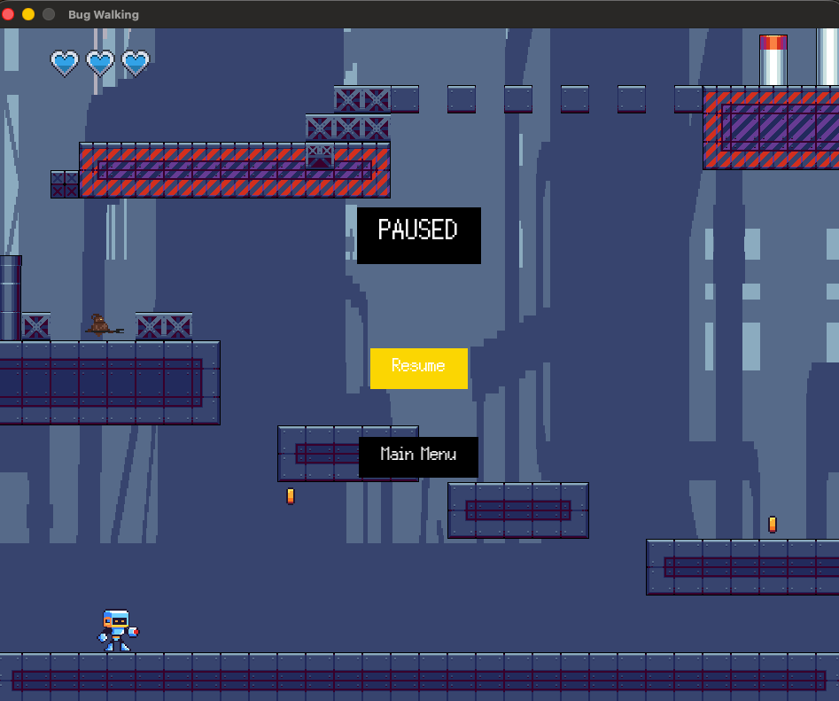

#  Bug Walking

Autores:
- Gabriel Edmundo Souza Rocha
- Heitor Luiz Pereira
- João Pedro Wadge Melo Pacheco
- Victor Kenji Pawlowski Abeki

BugWalking é um jogo de plataforma 2D em pixel art no qual o jogador controla um robô experimental defeituoso criado 
às pressas por um cientista durante uma iminente invasão alienígena. Após o laboratório ser destruído e o primeiro robô 
ter sido hackeado pelos invasores, o protagonista — incompleto, bugado e instável — precisa atravessar o laboratório e 
chegar ao local onde este está. O objetivo principal do jogador é restaurar gradualmente as funcionalidades do robô e 
enfrentar as invenções corrompidas do laboratório.

A estrutura do jogo reforça o tema de “conserto”: no início, movimentos, ataques e defesas têm comportamento 
probabilístico e imprevisível, criando sensação de caos e descontrole. À medida que o jogador progride, encontra itens 
que corrigem cada habilidade, permitindo controlar o robô de forma mais fluida e precisa. Nesse sentido, as mecânicas 
básicas incluem andar, correr, pular e atacar — todos liberados ou consertados conforme a evolução.

A condição de vitória é alcançar o fim do nível, emergindo do laboratório para unir-se à defesa da humanidade. Ademais, 
o jogador perde ao esgotar sua vida em combate ou falhar nos desafios de plataforma presentes ao longo da fase.

O jogador controla o personagem por meio das setas do teclado, pulando com a seta para cima, e ataca, atirando, 
com a tecla espaço; ele interage com os menus por meio da seta para cima e para baixo e da tecla enter — pressionando 
enter para escolher a opção e, no caso do menu de Pause, enter também pausa o jogo.

No começo do jogo, será perceptível para o jogador que, periodicamente, o personagem “trava”, não reconhecendo o input, 
e que nem todos os ataques são executados, isso se deve à mecânica relacionada ao fato do robô estar quebrado. Assim, 
ao longo do jogo, é preciso coletar engrenagens, no mapa, para consertar o personagem, diminuindo a frequência com que 
a “trava” ocorre e a porcentagem da falha dos ataques. Após coletar 2 engrenagens, o robô é consertado, significando 
que os problemas destacados deixam de ocorrer.

Gameplay:

Menus do jogo:
Pausa:

---

# Créditos dos Assets Utilizados
Robô personagem principal: https://nicopardo.itch.io/x-reploit-pack?download

Misseis: https://opengameart.org/content/custom-missiles

Inimigo 1: https://penusbmic.itch.io/sci-fi-character-pack-7

Industrial Zone: https://free-game-assets.itch.io/free-industrial-zone-tileset-pixel-art

Power Stattion: https://free-game-assets.itch.io/power-station-free-tileset-pixel-art?download#google_vignette

Barra de vida: https://atebits.itch.io/health-pack?download#google_vignette

logo: IA
