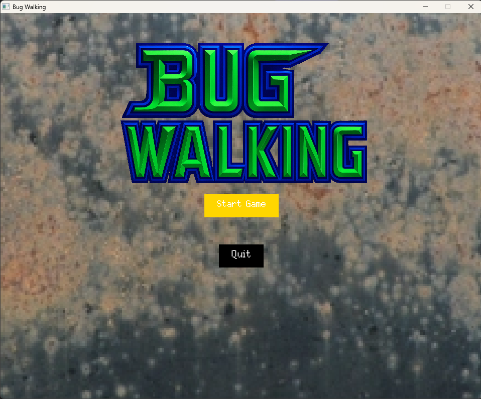
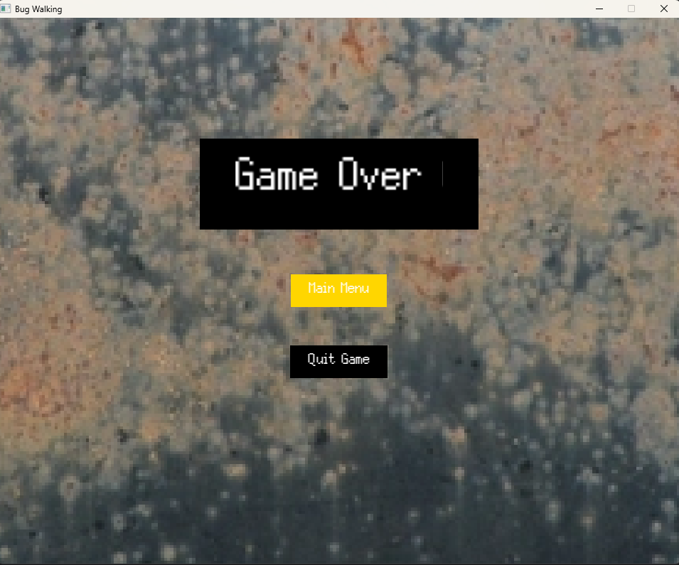
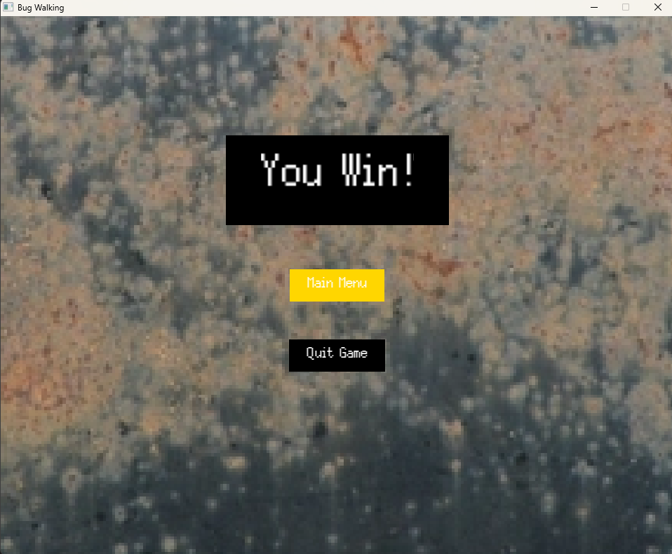

# BugWalking

## TÍTULO DO JOGO E AUTORES

O título do jogo é **BugWalking** (em referência jocosa à música *Smooth Criminal*, do cantor e rei do pop Michael Jackson).

**Autores:**
- Gabriel Edmundo Souza Rocha — 2020054412
- Heitor Luiz Pereira — 2024013672
- João Pedro Wadge Melo Pacheco — 2023028340
- Victor Kenji Pawlowski Abeki — 2020007090

---

## Descrição

**BugWalking** é um jogo de plataforma 2D em pixel art no qual o jogador controla um robô experimental defeituoso criado às pressas por um cientista durante uma iminente invasão alienígena. Após o laboratório ser destruído e o primeiro robô ter sido hackeado pelos invasores, o protagonista — incompleto, bugado e instável — precisa atravessar o laboratório e chegar ao local onde este está.

O objetivo principal é restaurar gradualmente suas funcionalidades e enfrentar as invenções corrompidas do laboratório. No início, movimentos, ataques e defesas têm comportamento probabilístico e imprevisível, reforçando o tema de caos e mau funcionamento. Conforme o jogador avança, itens encontrados nas fases corrigem cada habilidade, permitindo um controle progressivamente mais consistente e preciso.

O jogador vence ao alcançar o final do nível e perde ao esgotar a barra de vida ou falhar nos desafios de plataforma.

---

## Funcionalidades

- Movimentação com as setas do teclado
- Pulo com a seta **↑**
- Ataque (tiro) com **espaço**
- Navegação em menus com setas e **enter**
- **Enter** também pausa o jogo no menu de Pause
- O jogador pode derrotar inimigos **pulando sobre eles**

No início do jogo, o robô apresenta falhas: inputs podem não responder e ataques podem simplesmente não ser executados. Esses problemas fazem parte da mecânica central de “robô quebrado”.  
Ao coletar engrenagens espalhadas pelo mapa, a taxa de falhas diminui — após coletar **2 engrenagens**, o robô é totalmente consertado, eliminando travamentos e falhas de ataque.

É válido mencionar que tentar terminar a fase sem coletar as engrenagens é interessante para ver o impacto desses problemas intencionais.

---
Menus do jogo e gameplay:

---

# Créditos dos Assets Utilizados
Robô personagem principal: https://nicopardo.itch.io/x-reploit-pack?download  
Mísseis: https://opengameart.org/content/custom-missiles  
Inimigo 1: https://free-game-assets.itch.io/free-drones-pack-pixel-art  
Inimigo 2: https://penusbmic.itch.io/sci-fi-character-pack-7  
Industrial Zone: https://free-game-assets.itch.io/free-industrial-zone-tileset-pixel-art  
Power Station: https://free-game-assets.itch.io/power-station-free-tileset-pixel-art  
Barra de vida: https://atebits.itch.io/health-pack  
Fonte: https://poppyworks.itch.io/silver  
SFX do Glitch: https://opengameart.org/content/ice-electricity-magic
Musica de fundo: https://opengameart.org/content/the-gears-of-progress
Som da falha do disparo: https://pixabay.com/sound-effects/empty-gun-shot-6209/
Sprite da fumaça: https://opengameart.org/content/fire-smoke-animations
Logo: IA
